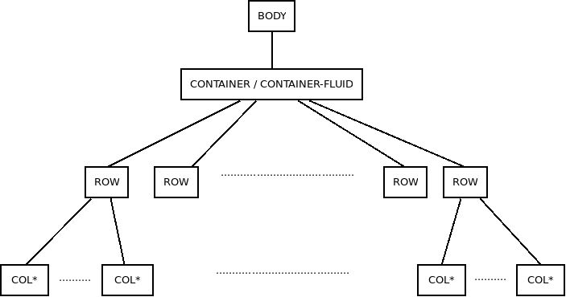
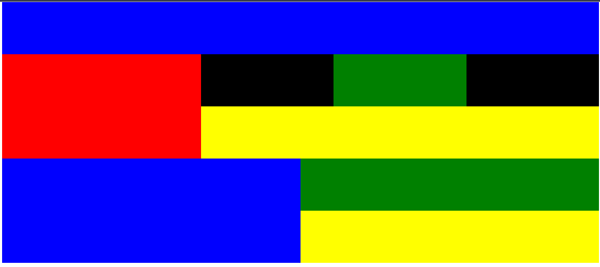

# Anidando filas

Hasta ahora estamos estado maquetando conforme a la estructura que hemos definido en apartados anteriores.

Esta estructura establece una jerarquía *contenedor* -> *row* -> *col*, es decir, todas las filas tienen elementos que única y exclusivamente pertenecen a dicha fila.

Sin embargo, los layout reales son más complejos que eso y para conseguir esas estructuras complejas vamos a tener que anidar filas (*row*) dentro de filas. Debemos de tener en cuenta que cada una de esas filas hijas podrá tener, de igual manera, hasta 12 columnas.

En la siguiente imagen tenemos un ejemplo de ese tipo de layouts con las distintas filas señaladas.

