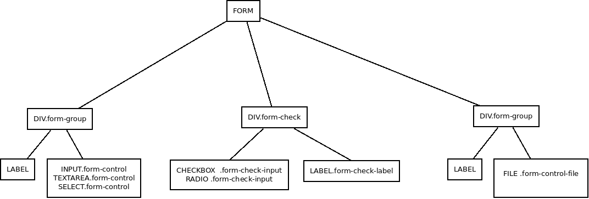

# Formularios

Aunque en la documentación oficial los formularios se encuentran en la sección de componentes lo cierto es que son un elemento fundamental que se incluye en páginas de registro, de consulta, de búsqueda etc. Por esa razón se ha decidido tratarlos de manera breve en este curso.

BootStrap proporciona una serie de clases para dar estilos a los distintos elementos de los formularios. De manera general podemos describir estas clases y la jerarquía que deben ocupar de la siguiente manera:

Además, se le añadirá al final un *input* de tipo *submit* o *button* con las clases correspondientes a los botones cuyos ejemplos más comunes (hay muchos más) son:

* **btn btn-primary**
* **btn btn-secondary**
* **btn btn-success**
* **btn btn-danger**
* **btn btn-warning**

Podemos además modificar ciertos aspectos de estos componentes del formulario. Los más interesantes son los siguientes.

* **Modificar el tamaño en altura del control**. Añadiendo clases como ***form-control-lg*** (grande) o ***form-control-sm*** (pequeños) en los *form-control.*

* **Modificar el tamaño en altura de la etiqueta del control**. Usando clases como ***col-label-lg*** (grandes)  o ***col-label-sm*** (pequeños).

* **Hacer que todos los elementos del formulario se vean en la misma línea** añadiendo la clase ***form-inline*** a la etiqueta form.

* **Hacer que las distintas opciones para elementos *radio* o *checkbox* se vean en la misma línea** añadiendo al div que tenía la clase *form-check* la clase ***form-check-inline***

* **Añadir texto de ayuda a los diferentes elementos** usando un etiqueta small dentro del *form-group* o *form-check* y dando a esa etiqueta las clases ***form-text*** y ***text-mute***.

En cuanto a su disposición, los formularios por defecto ocupan en anchura lo que ocupen el contenedor padre al que corresponden pero podemos adaptar su tamaño jugando con el grid de BootStrap 4 que hemos visto en capítulos anteriores añadiendo clases ***col-X*** (o atendiendo a distintos breakpoints) al elemento que contenga la clase *form-group* o *form-check*.

Para hacer los formularios más compactos hay una nueva clase que suprime el gutter, ***form-row*** que debe ser usada en ves de *row*.

Bootstrap 4 proporciona muchas más cosas en relación a los formularios, por eso, aunque con estos apuntes ya es suficiente para empezar a trabajar sin problemas, os recomiendo mirar tranquilamente la documentación. 
