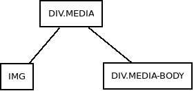

# El objeto *Media*

Para entender lo que es un objeto media  lo mejor  es irnos a la propio definición que nos da BootStrap 4:

*"son elementos complejos y repetitivos en los cuáles algún elemento multimedia (una imagen normalmente) se posiciona junto a otro elementos que "*


¿ Y éso qué es?. Pues son cosas que vemos diariamente como anuncios en la web, comentarios en blogs que llevan fotos de perfil, listas de tweets etc...

BootStrap 4 nos proporciona una manera fácil de construir este tipo de estructuras utilizando elementos flex, clases y etiquetas que compongan la siguiente jerarquía:



Por ejemplo:

```html

  <div class="media">
    
    <div class="media-body">
      <h3>Titulo</h3>
      <p>Texto relacionado</p>
      ...
    </div>
  </div>

```
Este tipo de estructuras se pueden anidar (como lo comentarios y las respuestas a un post).

Podemos también decidir cómo se van a disponer el resto de los elementos alrededor de la imagen usando clases como las siguiente y los márgenes correctos:

* ***align-self-start :*** Que alinea el contenido verticalmente con el borde superior de la imagen.
* ***align-self-center :*** La imagen queda centrada verticalmente en relación al resto de los elementos.
* ***align-self-end :*** Que alinea el contenido verticalmente con el borde superior de la imagen.

Si queremos que la imagen salga a la derecha sólo tenemos que cambiar la etiqueta en el HTML.

```html

  <div class="media">
    <div class="media-body">
      <h3>Titulo</h3>
      <p>Texto relacionado</p>
      ...
    </div>
    
  </div>

```

Si queremos construir listas (como si fuera el *timeline* de twitter debemos ponerle la clase *media* a los elementos las etiquetas *li* que sustituirán al *div.media* anterior)

Por ejemplo:

```html

    <ul>
      <li class="media">
        
        <div class="media-body">
          <h3>Titulo 1</h3>
          <p>Texto relacionado</p>
          ...
        </div>
      </li>
      <li class="media">
        
        <div class="media-body">
          <h3>Titulo 2</h3>
          <p>Texto relacionado 2</p>
          ...
        </div>
      </li>

    </ul>

```

***IMPORTANTE :*** Debemos darle las dimensiones a las imágenes.
